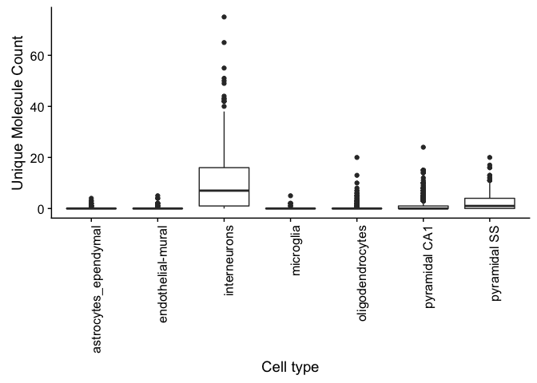
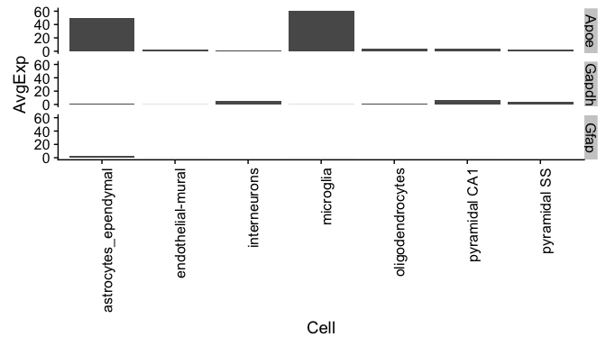
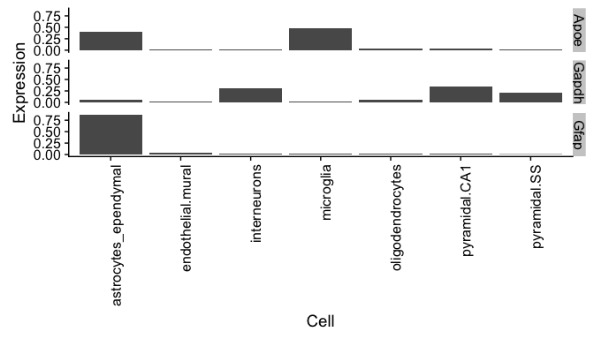
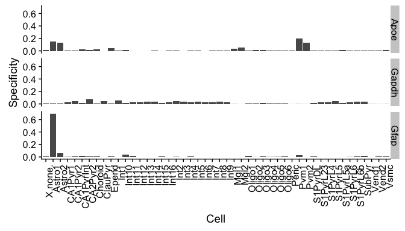
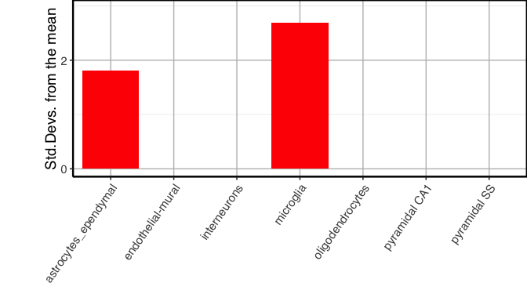
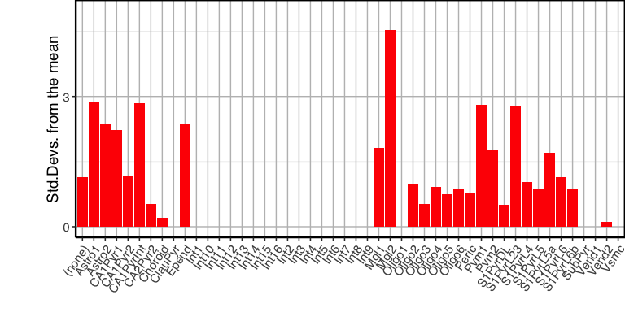
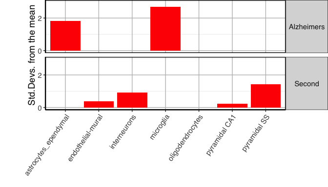
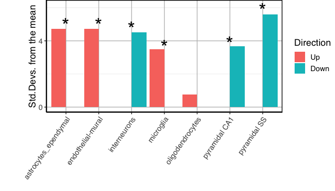
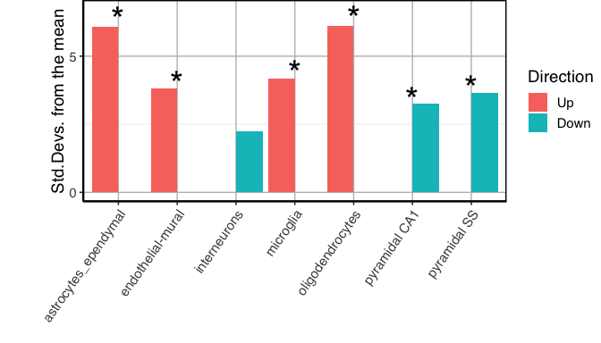
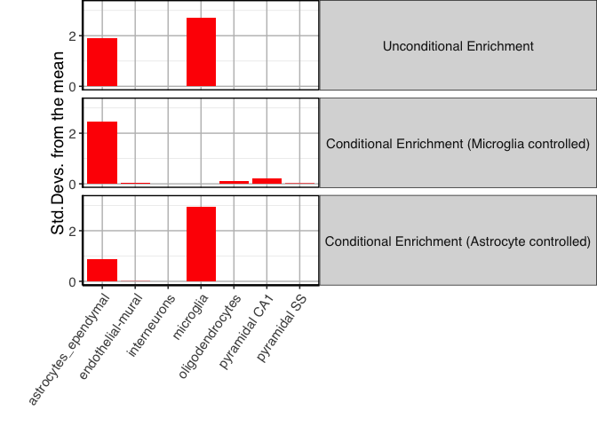

Expression Weighted Celltype Enrichment with *EWCE*
================
Nathan Skene
2018-11-08

<!-- Readme.md is generated from Readme.Rmd. Please edit that file -->
<script type="text/javascript">
document.addEventListener("DOMContentLoaded", function() {
  document.querySelector("h1").className = "title";
});
</script>
<script type="text/javascript">
document.addEventListener("DOMContentLoaded", function() {
  var links = document.links;  
  for (var i = 0, linksLength = links.length; i < linksLength; i++)
    if (links[i].hostname != window.location.hostname)
      links[i].target = '_blank';
});
</script>
Citation
========

If you use the EWCE package as well then please cite

[Skene, et al. Identification of Vulnerable Cell Types in Major Brain Disorders Using Single Cell Transcriptomes and Expression Weighted Cell Type Enrichment. Front. Neurosci, 2016.](https://www.frontiersin.org/articles/10.3389/fnins.2016.00016/full)

If you use the cortex/hippocampus single cell data associated with this package then please cite the following papers:

[Zeisel, et al. Cell types in the mouse cortex and hippocampus revealed by single-cell RNA-seq. Science, 2015.](http://www.sciencemag.org/content/early/2015/02/18/science.aaa1934.abstract)

Introduction
============

The *EWCE* package is designed to facilitate expression weighted celltype enrichment analysis as described in our Frontiers in Neuroscience paper<sup>1</sup>.

The package was originally designed to work with the single cell cortical transcriptome data from the Linnarsson lab<sup>2</sup> which is available at <http://linnarssonlab.org/cortex/>. Using this package it is possible to read in any single cell transcriptome data, provided that you have a cell by gene expression matrix (with each cell as a seperate column) and a seperate annotation dataframe, with a row for each cell.

The *EWCE* process involves testing for whether the genes in a target list have higher levels of expression in a given cell type than can reasonably be expected by chance. The probability distribution for this is estimated by randomly generating gene lists of equal length from a set of background genes.

The *EWCE* method can be applied to any gene list. In the paper we reported it's application to genetic and transcriptomic datasets, and in this vignette we detail how this can be done.

Note that throughout this vignette we use the terms 'cell type' and 'sub-cell type' to refer to two levels of annotation of what a cell type is. This is described in further detail in our paper<sup>1</sup>, but relates to the two levels of annotation provided in the Linnarsson dataset<sup>2</sup>. In this dataset a cell is described as having a cell type (i.e. 'Interneuron') and subcell type (i.e. 'Int11' a.k.a Interneuron type 11).

Overview
========

The process for using *EWCE* essentially involves three steps.

First, one needs to load the relevant single cell transcriptome dataset. Single cell transcriptome data is read in from a text file using the `read_celltype_data`.

The user then obtains a gene set and a suitable background gene set. As the choice of gene sets is up to the user we do not provide functions for doing this. Appropriate choice of background set is discussed in the associated publication.

Bootstrapping is then performed using the `bootstrap.enrichment.test` function.

Installing EWCE
===============

The *EWCE* package is available from github. The old version available from the Bioconductor archives is depreciated and should not be used. To be able to install the package one needs first to install R then run the following lines of code:

    install.packages("devtools")
    library(devtools)
    install_github("nathanskene/ewce")

You can then load the package:

``` r
library(EWCE)
library(ggplot2)
library(cowplot)
library(limma)
library(readxl)
```

Loading single cell transcriptome data
======================================

Loading datasets
----------------

The first step for all analyses is to load the single cell transcriptome (SCT) data. For the purposes of this example we will use the dataset described in *"Cell types in the mouse cortex and hippocampus revealed by single-cell RNA-seq", Science, 2015*. The following code downloads this file, passes it to the load.linnarsson.sct.data() function which extracts the expression and annotation data and returns these as a list.

Important note: you do NOT have to format your input single cell data like the Linnarsson data. Just read it into R such that you have an expression matrix and an annotation data frame. The three columns that you must have in the annotation data frame are "cell\_id", "level1class" and "level2class".

    download.file("goo.gl/r5Y24y",
        destfile="expression_mRNA_17-Aug-2014.txt") 

    path = "expression_mRNA_17-Aug-2014.txt"

    cortex_mrna  = load.linnarsson.sct.data(path)

To check the data we can quickly plot the distribution of expression of a given gene across all the cell types.

``` r
data("cortex_mrna")
gene="Necab1"
cellExpDist = data.frame(e=cortex_mrna$exp[gene,],l1=cortex_mrna$annot[colnames(cortex_mrna$exp),]$level1class)
ggplot(cellExpDist) + geom_boxplot(aes(x=l1,y=e)) + xlab("Cell type") + ylab("Unique Molecule Count") + theme(axis.text.x = element_text(angle = 90, hjust = 1))
```



It is very common for publically available transcriptome datasets to use incorrect gene symbols (often some gene names will have been mangled by opening in Excel). A function is provided to correct these where out of date aliases were used and give a warning if appears possible that excel has mangled some of the gene names. The first time you run it you will need to download the MRK\_List2 file from MGI which lists known synonyms for MGI gene symbols. We recommend running this on all input datasets.

    if(!file.exists("MRK_List2.rpt")){
        download.file("http://www.informatics.jax.org/downloads/reports/MRK_List2.rpt", destfile="MRK_List2.rpt")
    }
    cortex_mrna$exp = fix.bad.mgi.symbols(cortex_mrna$exp,mrk_file_path="MRK_List2.rpt")

Calculate specificity matrices
------------------------------

The next steps are as follows: 1) Drop genes which do not show significant evidence of varying between level 2 celltypes (based on ANOVA) 2) Calculate cell type averages and specificity for each gene 3) Drop all genes which do not have 1:1 mouse:human orthologs

The last step is only neccesary if you plan to compare to human data, i.e. genesets resulting from human genetics.

Rather than returning the data directly, the functions save the calculated data to a file and the filename is returned.

``` r
# Generate celltype data for just the cortex/hippocampus data
exp_CortexOnly_DROPPED = drop.uninformative.genes(exp=cortex_mrna$exp,level2annot = cortex_mrna$annot$level2class)
annotLevels = list(level1class=cortex_mrna$annot$level1class,level2class=cortex_mrna$annot$level2class)
fNames_CortexOnly = generate.celltype.data(exp=exp_CortexOnly_DROPPED,annotLevels=annotLevels,groupName="kiCortexOnly")
print(fNames_CortexOnly)
```

    ## [1] "CellTypeData_kiCortexOnly.rda"

``` r
fNames_CortexOnly = filter.genes.without.1to1.homolog(fNames_CortexOnly)
print(fNames_CortexOnly)
```

    ## [1] "CellTypeData_kiCortexOnly.rda"         
    ## [2] "CellTypeData_kiCortexOnly_1to1only.rda"

``` r
load(fNames_CortexOnly[1])
```

Merging two single cell datasets
--------------------------------

Often it is useful to merge two single cell datasets. For instance, there are seperate files for the cortex and hypothalamus datasets generated by the Karolinska. This dataset is first downloaded from GEO, unzipped and read into R. Because the file is in xlsx format you may need to install the readxl package. So first we just read in and prepare the expression matrix and annotation data frame:

    # Download the hypothalamus data and unzip
    if(!file.exists("GSE74672_expressed_mols_with_classes.xlsx")){
        download.file("ftp://ftp.ncbi.nlm.nih.gov/geo/series/GSE74nnn/GSE74672/suppl/GSE74672_expressed_mols_with_classes.xlsx.gz", destfile="GSE74672_expressed_mols_with_classes.xlsx.gz")
        system("gunzip GSE74672_expressed_mols_with_classes.xlsx.gz")
    }

    # Read in the hypothalamus data
    hypo_dat = read_excel("GSE74672_expressed_mols_with_classes.xlsx")

    # Extract the expression data, gene symbols and annotation data
    exp = data.matrix(hypo_dat[12:dim(hypo_dat)[1],2:dim(hypo_dat)[2]])
    rownames(exp) = data.frame(hypo_dat[12:dim(hypo_dat)[1],1])[,1]
    level1class = data.frame(level1class=t(hypo_dat[1,2:dim(hypo_dat)[2]]),stringsAsFactors = FALSE)[,1]
    level2class = data.frame(leve2class=t(hypo_dat[2,2:dim(hypo_dat)[2]]),stringsAsFactors = FALSE)[,1]
    cell_id     = colnames(hypo_dat)[2:dim(hypo_dat)[2]]
    hypo_annot  = data.frame(cell_id=cell_id,level1class=level1class,level2class=level2class,stringsAsFactors = FALSE)

    # Drop the glia and unclassified cells (which don't have level 2  annotations)
    hypo_annot  = hypo_annot[!is.na(hypo_annot$level2class) & !hypo_annot$level2class=="uc",]
    hypo_exp    = exp[,hypo_annot$cell_id]

    # Make the celltype names more aesthetically pleasing
    hypo_annot$level2class=gsub(",",";",hypo_annot$level2class)
    hypo_annot$level1class[grep("Oxt;|^Avp",hypo_annot$level2class)] = "Oxytocin / Vasopressin Expressing Neurons"
    hypo_annot$level1class[grep("^Th;|^Dopamine",hypo_annot$level2class)] = "Hypothalamic Dopaminergic Neurons"
    hypo_annot$level1class[grepl("^Vglut2|^Trh|^Qrfp|^Hcrt|^Pmch|^Adcyap1|^Npvf|^Ghrh|^Hmit|^Nms|^Vip;|^Per2|Tnr$|^Gad-low;Gnrh",hypo_annot$level2class) & grepl("neurons",hypo_annot$level1class)] = "Hypothalamic Glutamatergic Neurons"
    hypo_annot$level1class[grepl("GABA|^Sst|^Crh|^Npy|^Pomc|^Galanin|^Otof|Pnoc$|^Calcr-high",hypo_annot$level2class) & grepl("^neurons$",hypo_annot$level1class)] = "Hypothalamic GABAergic Neurons"
    hypo_annot$level2class[hypo_annot$level2class!=""] = sprintf("Hypothalamic %s Neuron",hypo_annot$level2class[hypo_annot$level2class!=""])

    # Fix bad MGI symbols
    hypo_exp_CORRECTED = fix.bad.mgi.symbols(hypo_exp)

Now that the hypothalamus data is prepared, we merge it with the cortex dataset then calculate specificity:

    # Merge the datasets
    merged_KI = merge_two_expfiles(exp1=hypo_exp_CORRECTED,  exp2=cortex_mrna$exp,
                                         annot1=hypo_annot,        annot2=cortex_mrna$annot,
                                         name1="Hypothalamus (KI)", name2="Cortex/Hippo (KI)")

    # Drop genes which don't vary significantly between cell types
    exp_merged_DROPPED = drop.uninformative.genes(exp=merged_KI$exp, level2annot = merged_KI$annot$level2class)

    # Calculate specificity data
    annotLevels = list(level1class=merged_KI$annot$level1class,level2class=merged_KI$annot$level2class)
    fNames_MergedKI = generate.celltype.data(exp=exp_merged_DROPPED,annotLevels,"MergedKI")
    fNames_MergedKI = filter.genes.without.1to1.homolog(fNames_MergedKI)
    load(fNames_MergedKI[2])

Understanding specificity matrices
----------------------------------

While not required for further analyses it helps to understand what the outputs of this function are.

Note firstly, that it is a list such that ctd\[\[1\]\] contains data relating to level 1 annotations and ctd\[\[2\]\] relates to level 2 annotations.

Using the ggplot2 package to visualise the data, let us examine the expression of a few genes. If you have not already done so you will need to first install the ggplot2 package with `install.packages("ggplot2")`.

For this example we use a subset of the genes from the merged dataset generated above, which is accessed using `data(ctd)`. We recommend that you use the code above to regenerate this though and drop the `data` command from the below section.

``` r
data("ctd")
set.seed(1234)
library(reshape2)
genes = c("Apoe","Gfap","Gapdh")
exp = melt(cbind(ctd[[1]]$mean_exp[genes,],genes),id.vars="genes")
colnames(exp) = c("Gene","Cell","AvgExp")
ggplot(exp)+geom_bar(aes(x=Cell,y=AvgExp),stat="identity")+facet_grid(Gene~.)+ 
    theme(axis.text.x = element_text(angle = 90, hjust = 1))
```



This graph shows the average expression of three genes: *Apoe, Gfap* and *Gapdh*. While there are substantial differences in which cell types express these genes, the dominant effect seen here is the overall expression level of the data. For the purposes of this analysis though, we are not interested in overall expression level and only wish to know about the proportion of a genes expression which is found in a particular celltype. We can study this instead using the following code which examines the data frame *ctd\[\[1\]\]$specificity*:

``` r
exp = melt(cbind(data.frame(ctd[[1]]$specificity[genes,]),genes),id.vars="genes")
colnames(exp) = c("Gene","Cell","Expression")
ggplot(exp)+geom_bar(aes(x=Cell,y=Expression),stat="identity")+facet_grid(Gene~.)+ 
    theme(axis.text.x = element_text(angle = 90, hjust = 1))
```



We can now see in this graph that *Gfap* is the most specific to a cell type (Type 1 Astrocytes) of either of those three genes, with over 60% of it's expression found in that cell type.

It can also be seen that the majority of expression of Gapdh is in neurons but because their are a greater number of neuronal subtypes, the total expression proportion appears lower. We can examine expression across level 2 celltype level annotations by looking at *ctd\[\[2\]\]$specificity*:

``` r
exp = melt(cbind(data.frame(ctd[[2]]$specificity[genes,]),genes),id.vars="genes")
colnames(exp) = c("Gene","Cell","Specificity")
ggplot(exp)+geom_bar(aes(x=Cell,y=Specificity),stat="identity")+facet_grid(Gene~.)+ 
    theme(axis.text.x = element_text(angle = 90, hjust = 1))
```



Application to genetic data
===========================

Preparing gene lists
--------------------

For the first demonstration of EWCE we will test for whether genes that are genetically associated with Alzheimer's disease are enriched in any particular celltype. This gene list is stored within the package are we access it by first loading the package and then the dataset:

``` r
data("example_genelist")
print(example_genelist)
```

    ##  [1] "APOE"     "BIN1"     "CLU"      "ABCA7"    "CR1"      "PICALM"  
    ##  [7] "MS4A6A"   "CD33"     "MS4A4E"   "CD2AP"    "EOGA1"    "INPP5D"  
    ## [13] "MEF2C"    "HLA-DRB5" "ZCWPW1"   "NME8"     "PTK2B"    "CELF1"   
    ## [19] "SORL1"    "FERMT2"   "SLC24A4"  "CASS4"

All gene IDs are assumed by the package to be provided in gene symbol format (rather than Ensembl/Entrez). Symbols can be provided as either HGNC or MGI symbols, though the genelistSpecies argument will need to be set appropriately. Likewise, the single cell dataset can use either human or mouse gene symbols, but the sctSpecies argument must be set to either "human" or "mouse". The default species for both is mouse.

The example gene list here stores the human genes associated with disease, and hence are HGNC symbols.

The next step is to determine the most suitable background set. The experimental methods used to find these gene are all genome wide, so there is no restriction imposed as a result of that. Thus our initial background set is the set of all human genes. Not all human genes have mouse orthologs however, so we need to drop all genes from the target and background set which do not have mouse orthologs. To save repeatedly querying biomaRt we have a stored dataset containing all the human orthologs of MGI genes, `mouse_to_human_homologs`. We can use this to obtain the mouse orthologs of the target and background genes at the same time as we drop genes without orthologs:

``` r
data("mouse_to_human_homologs")
m2h = unique(mouse_to_human_homologs[,c("HGNC.symbol","MGI.symbol")])
mouse.hits = unique(m2h[m2h$HGNC.symbol %in% example_genelist,"MGI.symbol"])
#mouse.bg  = unique(setdiff(m2h$MGI.symbol,mouse.hits))
mouse.bg  = unique(m2h$MGI.symbol)
```

The target list is now converted to MGI symbols:

``` r
print(mouse.hits)
```

    ##  [1] "Apoe"    "Inpp5d"  "Cd2ap"   "Nme8"    "Cass4"   "Mef2c"   "Zcwpw1" 
    ##  [8] "Bin1"    "Clu"     "Celf1"   "Abca7"   "Slc24a4" "Ptk2b"   "Picalm" 
    ## [15] "Fermt2"  "Sorl1"

And we have 15604 genes in background set.

Setting analysis parameters
---------------------------

We now need to set the parameters for the analysis. For a publishable analysis we would want to generate over 10000 random lists and determine their expression levels, but for computational speed let us only use `reps=1000`. We want to analyse level 1 annotations so set level to 1.

``` r
reps=1000 # <- Use 1000 bootstrap lists so it runs quickly, for publishable analysis use >10000
level=1 # <- Use level 1 annotations (i.e. Interneurons)
```

Running EWCE analysis on genetic data
-------------------------------------

We have now loaded the SCT data, prepared the gene lists and set the parameters. We run the model as follows:

``` r
# Bootstrap significance testing, without controlling for transcript length and GC content
full_results = bootstrap.enrichment.test(sct_data=ctd,hits=mouse.hits,bg=mouse.bg,
                                reps=reps,annotLevel=level)
```

    ##  [1] "Apoe"    "Inpp5d"  "Cd2ap"   "Nme8"    "Cass4"   "Mef2c"   "Zcwpw1" 
    ##  [8] "Bin1"    "Clu"     "Celf1"   "Abca7"   "Slc24a4" "Ptk2b"   "Picalm" 
    ## [15] "Fermt2"  "Sorl1"  
    ## [1] "astrocytes_ependymal"
    ## [1] 0.054
    ## [1] ""
    ## [1] "endothelial-mural"
    ## [1] 0.601
    ## [1] ""
    ## [1] "interneurons"
    ## [1] 1
    ## [1] ""
    ## [1] "microglia"
    ## [1] 0.014
    ## [1] "Fold enrichment: 2.02369844284128"
    ## [1] "Standard deviations from mean: 2.69149534380412"
    ## [1] ""
    ## [1] "oligodendrocytes"
    ## [1] 0.524
    ## [1] ""
    ## [1] "pyramidal CA1"
    ## [1] 0.647
    ## [1] ""
    ## [1] "pyramidal SS"
    ## [1] 0.663
    ## [1] ""

The main table of results is stored in `full_results$results`. We can see the most significant results using:

``` r
print(full_results$results[order(full_results$results$p),3:5][1:6,])
```

    ##                          p fold_change sd_from_mean
    ## microglia            0.014   2.0236984    2.6914953
    ## astrocytes_ependymal 0.054   1.5960026    1.8111846
    ## oligodendrocytes     0.524   0.9465844   -0.2156873
    ## endothelial-mural    0.601   0.8461038   -0.4393394
    ## pyramidal CA1        0.647   0.9388163   -0.4008988
    ## pyramidal SS         0.663   0.9280526   -0.4991304

The results can be visualised using another function, which shows for each cell type, the number of standard deviations from the mean the level of expression was found to be in the target gene list, relative to the bootstrapped mean:

``` r
print(ewce.plot(full_results$results,mtc_method="BH"))
```



If you want to view the characteristics of enrichment for each gene within the list then the `generate.bootstrap.plots` function should be used. This saves the plots into the BootstrapPlots folder. This takes the results of a bootstrapping analysis so as to only generate plots for significant enrichments. The `listFileName` argument is used to give the generated graphs a particular file name.

``` r
generate.bootstrap.plots(sct_data=ctd,hits=mouse.hits,bg=mouse.bg,reps=100,annotLevel=1,full_results=full_results,listFileName="VignetteGraphs")
```

Running EWCE analysis on genetic data with controls for transcript length and GC-content
----------------------------------------------------------------------------------------

When analysing genes found through genetic association studies it is important to consider biases which might be introduced as a result of transcript length and GC-content. The package can control for these by selecting the bootstrap lists such that the *i<sup>th</sup>* gene in the random list has properties similar to the*i<sup>th</sup>* gene in the target list. To enable the algorithm to do this it needs to be passed the gene lists as HGNC symbols rather than MGI.

``` r
#human.hits = unique(m2h[m2h$HGNC.symbol %in% example_genelist,"HGNC.symbol"])
#human.bg = unique(setdiff(m2h$HGNC.symbol,human.hits))
human.hits = example_genelist
human.bg = unique(c(human.hits,m2h$HGNC.symbol))
```

The bootstrapping function then takes different arguments:

``` r
# Bootstrap significance testing controlling for transcript length and GC content
cont_results = bootstrap.enrichment.test(sct_data=ctd,hits=human.hits,
                    bg=human.bg,reps=reps,annotLevel=1,geneSizeControl=TRUE,genelistSpecies="human",sctSpecies="mouse")
```

We plot these results using `ewce.plot`:

``` r
print(ewce.plot(cont_results$results,mtc_method="BH"))
```


This shows that the controlled method generates enrichments that are generally comparable to the standard method.

Running EWCE analysis on cell type level annotations
----------------------------------------------------

Both the analyses shown above were run on level 1 annotations. It is possible to test on the level 2 cell type level annotations by changing one of the arguments.

``` r
# Bootstrap significance testing controlling for transcript length and GC content
cont_results = bootstrap.enrichment.test(sct_data=ctd,hits=human.hits,
                    bg=human.bg,reps=reps,annotLevel=2,geneSizeControl=TRUE,genelistSpecies="human",sctSpecies="mouse")
print(ewce.plot(cont_results$results,mtc_method="BH"))
```



With the subcell analysis each microglial subtype was enriched and correspondingly we see here that the microglial celltype is enriched.

Plotting results from multiple gene lists
-----------------------------------------

It is often useful to plot results from multiple gene list analyses together. The `ewce.plot` function allows multiple enrichment analyses to be performed together. To achieve this the results data frames are just appended onto each other, with an additional `list` column added detailing which analysis they relate to.

To demonstrate this we need to first generate a second analysis so let us sample thirty random genes, and run the bootstrapping analysis on it.

``` r
gene.list.2 = mouse.bg[1:30]
second_results = bootstrap.enrichment.test(sct_data=ctd,hits=gene.list.2,
                    bg=mouse.bg,reps=reps,annotLevel=1)
```

    ##  [1] "Rcl1"   "Myom1"  "Gpr12"  "Micu2"  "Pds5b"  "Jagn1"  "Rbm17" 
    ##  [8] "Trib2"  "Theg"   "Itpr1"  "Prmt5"  "Usp6nl" "Fgf9"   "Map1a" 
    ## [15] "Samd11" "Noc2l" 
    ## [1] "astrocytes_ependymal"
    ## [1] 0.93
    ## [1] ""
    ## [1] "endothelial-mural"
    ## [1] 0.329
    ## [1] ""
    ## [1] "interneurons"
    ## [1] 0.178
    ## [1] ""
    ## [1] "microglia"
    ## [1] 0.868
    ## [1] ""
    ## [1] "oligodendrocytes"
    ## [1] 0.702
    ## [1] ""
    ## [1] "pyramidal CA1"
    ## [1] 0.387
    ## [1] ""
    ## [1] "pyramidal SS"
    ## [1] 0.073
    ## [1] ""

``` r
full_res2 = data.frame(full_results$results,list="Alzheimers")
scnd_res2 = data.frame(second_results$results,list="Second")
merged_results = rbind(full_res2,scnd_res2)
```

``` r
print(ewce.plot(total_res=merged_results,mtc_method="BH"))
```



As expected, the second randomly generated gene list shows no significant enrichments.

Application to transcriptomic data
==================================

Analysing single transcriptome study
------------------------------------

For the prior analyses the gene lists were not associated with any numeric values or directionality. The methodology for extending this form of analysis to transcriptomic studies simply involves thresholding the most upregulated and downregulated genes.

To demonstrate this we have an example dataset `tt_alzh`. This data frame was generated using limma from a set of post-mortem tissue samples from brodmann area 46 which were described in a paper by the Haroutunian lab<sup>3</sup>.

The first step is to load the data, obtain the MGI ids, sort the rows by t-statistic and then select the most up/down-regulated genes. The package then has a function `ewce_expression_data` which thresholds and selects the gene sets, and calls the EWCE function. Below we show the function call using the default settings, but if desired different threshold values can be used, or alternative columns used to sort the table.

``` r
data(tt_alzh)
tt_results = ewce_expression_data(sct_data=ctd,tt=tt_alzh,annotLevel=1,ttSpecies="human",sctSpecies="mouse")
```

The results of this analysis can again be plotted using the `ewce.plot` function.

``` r
ewce.plot(tt_results$joint_results)
```



As was reported in our paper, neuronal genes are found to be downregulated while glial genes are upregulated.

Merging multiple transcriptome studies
--------------------------------------

Where multiple transcriptomic studies have been performed with the same purpose, i.e. seeking differential expression in dlPFC of post-mortem schizophrenics, it is common to want to determine whether they exhibit any shared signal. EWCE can be used to merge the results of multiple studies.

To demonstrate this we use a two further Alzheimer's transcriptome dataset coming from Brodmann areas 36 and 44: these area stored in `tt_alzh_BA36` and `tt_alzh_BA44`. The first step is to run EWCE on each of these individually and store the output into one list.

``` r
# Load the data
data(tt_alzh_BA36)
data(tt_alzh_BA44)

# Run EWCE analysis
tt_results_36 = ewce_expression_data(sct_data=ctd,tt=tt_alzh_BA36,annotLevel=1,ttSpecies="human",sctSpecies="mouse")
tt_results_44 = ewce_expression_data(sct_data=ctd,tt=tt_alzh_BA44,annotLevel=1,ttSpecies="human",sctSpecies="mouse")

# Fill a list with the results
results = add.res.to.merging.list(tt_results)
results = add.res.to.merging.list(tt_results_36,results)
results = add.res.to.merging.list(tt_results_44,results)

# Perform the merged analysis
merged_res = merged_ewce(results,reps=10) # <- For publication reps should be higher
print(merged_res)
```

The results can then be plotted as normal using the `ewce.plot` function.

``` r
print(ewce.plot(merged_res))
```



The merged results from all three Alzheimer's brain regions are found to be remarkably similar, as was reported in our paper.

Conditional cell type enrichment analysis
=========================================

Controlling for expression in another cell type
-----------------------------------------------

In a followup paper we found that an enrichment detected for Schizophrenia in Somatosensory Pyramidal neurons could be explained by accounting for expression in Hippocampal CA1 pyramidal neurons. These results are described here:

[Skene, et al. Genetic identification of brain cell types underlying schizophrenia. Nature Genetics, 2018.](https://www.nature.com/articles/s41588-018-0129-5)

Those results were generated using an alternative enrichment method designed for use with GWAS Summary Statistics rather than gene sets. The same sort of approach can be extended to EWCE as well, and we have implemented it within this package. When testing for enrichment the other gene sets that are sampled are selected to have equivilent specificity in the controlled celltype.

We demonstrate it's use below to test whether the enrichment in astrocytes is still present after controlling for the enrichment within microglia:

``` r
data("mouse_to_human_homologs")
m2h = unique(mouse_to_human_homologs[,c("HGNC.symbol","MGI.symbol")])
mouse.hits = unique(m2h[m2h$HGNC.symbol %in% example_genelist,"MGI.symbol"])
mouse.bg  = unique(m2h$MGI.symbol)

reps=1000
unconditional_results = bootstrap.enrichment.test(sct_data=ctd,hits=mouse.hits,
                    bg=mouse.bg,reps=reps,annotLevel=1,genelistSpecies="mouse",sctSpecies="mouse")
```

    ##  [1] "Apoe"    "Inpp5d"  "Cd2ap"   "Nme8"    "Cass4"   "Mef2c"   "Zcwpw1" 
    ##  [8] "Bin1"    "Clu"     "Celf1"   "Abca7"   "Slc24a4" "Ptk2b"   "Picalm" 
    ## [15] "Fermt2"  "Sorl1"  
    ## [1] "astrocytes_ependymal"
    ## [1] 0.044
    ## [1] "Fold enrichment: 1.61075434352815"
    ## [1] "Standard deviations from mean: 1.90933629115277"
    ## [1] ""
    ## [1] "endothelial-mural"
    ## [1] 0.604
    ## [1] ""
    ## [1] "interneurons"
    ## [1] 1
    ## [1] ""
    ## [1] "microglia"
    ## [1] 0.015
    ## [1] "Fold enrichment: 2.06505599892457"
    ## [1] "Standard deviations from mean: 2.7209383544878"
    ## [1] ""
    ## [1] "oligodendrocytes"
    ## [1] 0.522
    ## [1] ""
    ## [1] "pyramidal CA1"
    ## [1] 0.658
    ## [1] ""
    ## [1] "pyramidal SS"
    ## [1] 0.695
    ## [1] ""

``` r
conditional_results_micro = bootstrap.enrichment.test(sct_data=ctd,hits=mouse.hits,
                    bg=mouse.bg,reps=reps,annotLevel=1,controlledCT="microglia",genelistSpecies="mouse",sctSpecies="mouse")
```

    ##  [1] "Apoe"    "Inpp5d"  "Cd2ap"   "Nme8"    "Cass4"   "Mef2c"   "Zcwpw1" 
    ##  [8] "Bin1"    "Clu"     "Celf1"   "Abca7"   "Slc24a4" "Ptk2b"   "Picalm" 
    ## [15] "Fermt2"  "Sorl1"  
    ## [1] "astrocytes_ependymal"
    ## [1] 0.022
    ## [1] "Fold enrichment: 1.71342601619128"
    ## [1] "Standard deviations from mean: 2.44919592202938"
    ## [1] ""
    ## [1] "endothelial-mural"
    ## [1] 0.421
    ## [1] ""
    ## [1] "interneurons"
    ## [1] 1
    ## [1] ""
    ## [1] "microglia"
    ## [1] 0.535
    ## [1] ""
    ## [1] "oligodendrocytes"
    ## [1] 0.399
    ## [1] ""
    ## [1] "pyramidal CA1"
    ## [1] 0.4
    ## [1] ""
    ## [1] "pyramidal SS"
    ## [1] 0.457
    ## [1] ""

``` r
conditional_results_astro = bootstrap.enrichment.test(sct_data=ctd,hits=mouse.hits,
                    bg=mouse.bg,reps=reps,annotLevel=1,controlledCT="astrocytes_ependymal",genelistSpecies="mouse",sctSpecies="mouse")
```

    ##  [1] "Apoe"    "Inpp5d"  "Cd2ap"   "Nme8"    "Cass4"   "Mef2c"   "Zcwpw1" 
    ##  [8] "Bin1"    "Clu"     "Celf1"   "Abca7"   "Slc24a4" "Ptk2b"   "Picalm" 
    ## [15] "Fermt2"  "Sorl1"  
    ## [1] "astrocytes_ependymal"
    ## [1] 0.193
    ## [1] ""
    ## [1] "endothelial-mural"
    ## [1] 0.389
    ## [1] ""
    ## [1] "interneurons"
    ## [1] 1
    ## [1] ""
    ## [1] "microglia"
    ## [1] 0.005
    ## [1] "Fold enrichment: 2.10197457213456"
    ## [1] "Standard deviations from mean: 2.95302989520271"
    ## [1] ""
    ## [1] "oligodendrocytes"
    ## [1] 0.483
    ## [1] ""
    ## [1] "pyramidal CA1"
    ## [1] 0.487
    ## [1] ""
    ## [1] "pyramidal SS"
    ## [1] 0.524
    ## [1] ""

``` r
full_res1 = data.frame(unconditional_results$results,list="Unconditional Enrichment")
full_res2 = data.frame(conditional_results_micro$results,list="Conditional Enrichment (Microglia controlled)")
full_res3 = data.frame(conditional_results_astro$results,list="Conditional Enrichment (Astrocyte controlled)")
merged_results = rbind(rbind(full_res1,full_res2),full_res3)
print(ewce.plot(total_res=merged_results,mtc_method="BH"))
```



When controlling for astrocytes the enrichment is astrocytes is totally abolished as expected, and vica versa. The enrichment in microglia remains strongly significant however after controlling for microglia, suggesting that this enrichment is independent of that in astrocytes.

Gene set enrichment analysis controlling for cell type expression
-----------------------------------------------------------------

Traditionally the standard analysis run on all gene sets was the GO enrichment analysis. Once you have established that a given gene list is enriched for a given celltype, it becomes questionable whether a GO enrichment is driven purely by the underlying cell type enrichment. For instance, it is well established that genes associated with schizophrenia are enriched for the human post-synaptic density genes, however, it has also been shown that schizophrenia is enriched for specificity in CA1 pyramidal neurons (which highly express hPSD genes). These two enrichments can be disassociated using the following analysis:

``` r
data("mouse_to_human_homologs")
m2h = unique(mouse_to_human_homologs[,c("HGNC.symbol","MGI.symbol")])

data("schiz_genes")
data("id_genes")
mouse.hits.schiz = unique(m2h[m2h$HGNC.symbol %in% schiz_genes,"MGI.symbol"])
mouse.hits.id = unique(m2h[m2h$HGNC.symbol %in% id_genes,"MGI.symbol"])
mouse.bg  = unique(m2h$MGI.symbol)

data("hpsd_genes")
mouse.hpsd = unique(m2h[m2h$HGNC.symbol %in% hpsd_genes,"MGI.symbol"])

data("rbfox_genes")

res_hpsd_schiz = controlled_geneset_enrichment(disease_genes=mouse.hits.schiz, functional_genes = mouse.hpsd, bg_genes = mouse.bg, sct_data = ctd, annotLevel = 1, reps=1000, controlledCT="pyramidal CA1")
res_rbfox_schiz = controlled_geneset_enrichment(disease_genes=mouse.hits.schiz, functional_genes = rbfox_genes, bg_genes = mouse.bg, sct_data = ctd, annotLevel = 1, reps=1000, controlledCT="pyramidal CA1")
print(res_hpsd_schiz)
print(res_rbfox_schiz)

res_hpsd_id = controlled_geneset_enrichment(disease_genes=mouse.hits.id, functional_genes = mouse.hpsd, bg_genes = mouse.bg, sct_data = ctd, annotLevel = 1, reps=1000, controlledCT="pyramidal SS")
res_rbfox_id = controlled_geneset_enrichment(disease_genes=mouse.hits.id, functional_genes = rbfox_genes, bg_genes = mouse.bg, sct_data = ctd, annotLevel = 1, reps=1000, controlledCT="pyramidal SS")
print(res_hpsd_id)
print(res_rbfox_id)
```

The analysis also tests for enrichment of Rbfox binding genes in the schizophrenia susceptibility genes, as well as both hPSD and Rbfox genes in Intellectual Disability genes. All of the enrichments are confirmed as still being present after controlling for the associated cell type, apart from the enrichment of PSD genes in Schizophrenia which falls from borderline to non-significant.

Controlling for multiple cell types
-----------------------------------

``` r
controlledCTs = c("pyramidal CA1","pyramidal SS","interneurons")

res_hpsd_schiz = controlled_geneset_enrichment(disease_genes=mouse.hits.schiz, functional_genes = mouse.hpsd, bg_genes = mouse.bg, sct_data = ctd, annotLevel = 1, reps=1000, controlledCT=controlledCTs)
res_rbfox_schiz = controlled_geneset_enrichment(disease_genes=mouse.hits.schiz, functional_genes = rbfox_genes, bg_genes = mouse.bg, sct_data = ctd, annotLevel = 1, reps=1000, controlledCT=controlledCTs)
print(res_hpsd_schiz)
print(res_rbfox_schiz)

res_hpsd_id = controlled_geneset_enrichment(disease_genes=mouse.hits.id, functional_genes = mouse.hpsd, bg_genes = mouse.bg, sct_data = ctd, annotLevel = 1, reps=1000, controlledCT=controlledCTs)
res_rbfox_id = controlled_geneset_enrichment(disease_genes=mouse.hits.id, functional_genes = rbfox_genes, bg_genes = mouse.bg, sct_data = ctd, annotLevel = 1, reps=1000, controlledCT=controlledCTs)
print(res_hpsd_id)
print(res_rbfox_id)
```

References
==========

1. Skene, N. & Grant, S. Identification of vulnerable cell types in major brain disorders using single cell transcriptomes and expression weighted cell type enrichment. *Frontiers in Neuroscience* (2016). doi:[10.3389/fnins.2016.00016](https://doi.org/10.3389/fnins.2016.00016)

2. Zeisel, A. *et al.* Cell types in the mouse cortex and hippocampus revealed by single-cell rna-seq. *Science* **347,** 1138–1142 (2015).

3. Haroutunian, V., Katsel, P. & Schmeidler, J. Transcriptional vulnerability of brain regions in alzheimer’s disease and dementia. *Neurobiology of aging* **30,** 561–573 (2009).
